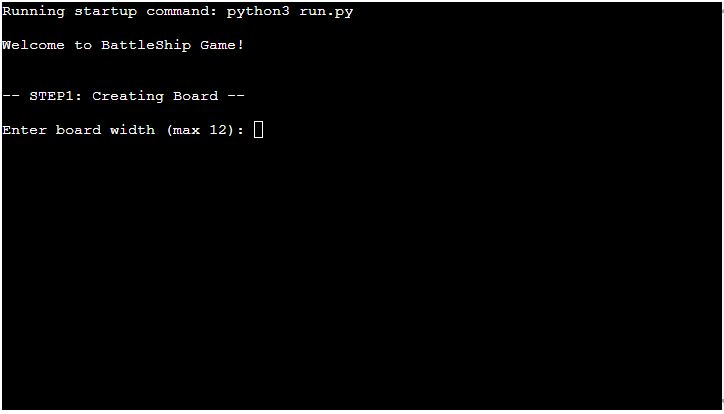
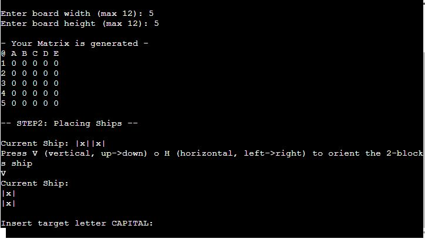
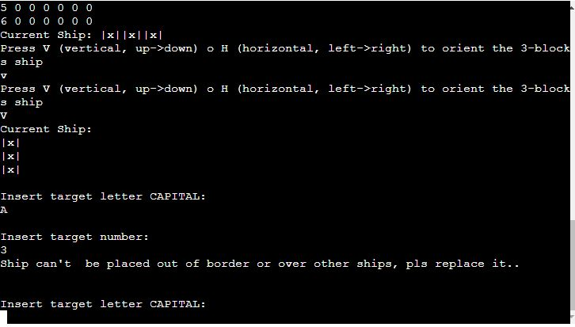

#BATTLESHIP

#Code Institute Portfolio Project 3

The application allows the user to play a simple version of naval battles. The scope of the game is to destroy all opponent's ship.

A live version of the game can be found [here](https://battlehip.herokuapp.com/)

# table of content:

- [How to play](#howtoplay)
    - [Scope](#scope)
    - [Board](#board)
- [Set Ships](#ships)
    - [Orienting Ships](#orienting)
    - [The Game](#Game)
- [Deployment](#deployment)

# How to play:
 

## Scope
 

In this game you will need to destroy all opponent's battleships. Theese ships are gonna be generated randomly 

## Board

The first thing you have to do is to set the board size, it can be set with a maximum of 12 cells, by inserting width and height

# Set Ships

## Orienting ships

Once you've set the board, you're gonna have to set ships, fist of all you have to choose if you wanna set the ship horizontally or vertically by pressing respectively H or V

After that, you're gonna have to choose where to set the ships, so you're asked to choose a letter and a number

Then you're gonna have to set the 3 blocks ship with the same method as for the 2 blocks. It is not possible to set the ship outside the board or over another ship

## The Game

Once all the ships are deployed, the game starts, if i hit a ship controlled by the CPU the correct message comes out

If you hit all CPU'S Ship you win

# Deployment

This project was deployed using Heroku.

1. Fork or clone this repository

2. Create a new Heroku app

3. Set the buildbacks to Python and NodeJS in that order

4. Link the Heroku app to repository

5. Click on Deploy